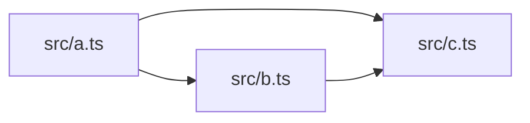
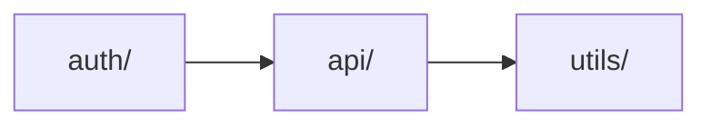

# Code Architecture Diagram MCP

A Model Context Protocol (MCP) server that analyzes TypeScript/JavaScript code dependencies and generates architecture diagrams for AI agents.

## Features

- **Multi-level dependency analysis** - Analyze dependencies at file, module, or component level
- **Interface implementation tracking** (Phase 3) - Track `class implements Interface` relationships
- **React component rendering** (Phase 4) - Track JSX component rendering relationships (`<Parent><Child /></Parent>`)
- **Hierarchical aggregation** - Reduce complexity by 50-100x for large projects
- **MCP Protocol support** - Direct integration with Claude Desktop and other MCP-compatible AI agents
- **Mermaid diagram generation** - Outputs beautiful, copy-paste-ready dependency graphs with visual distinction for different edge types
- **Fast & efficient** - Handles projects with 1000+ files in seconds
- **Zero configuration** - Works out of the box with any TypeScript/JavaScript project

## Installation

### Global Installation (Recommended)

```bash
npm install -g code-architecture-diagram-mcp
```

### Local Installation

```bash
npm install code-architecture-diagram-mcp
```

## Usage

### With Claude Desktop

Add to your Claude Desktop MCP configuration file:

**macOS**: `~/Library/Application Support/Claude/claude_desktop_config.json`

**Windows**: `%APPDATA%\Claude\claude_desktop_config.json`

```json
{
  "mcpServers": {
    "code-arch": {
      "command": "code-arch-mcp"
    }
  }
}
```

Restart Claude Desktop, then use the `getDependencyGraph` tool:

```
Can you analyze the dependencies in my project at /path/to/my-project?
```

For large projects, you can request module-level view for better clarity:

```
Can you analyze the dependencies at module level for /path/to/my-project?
```

**Phase 3: Interface Implementation Tracking**

Track interface implementation relationships:

```
Can you show me which classes implement which interfaces in /path/to/my-project?
Use edgeTypes: ['import', 'implement'] to show both imports and interface implementations.
```

**Phase 4: React Component Rendering Relationships**

Track UI component composition and rendering hierarchy:

```
Can you show me the React component rendering hierarchy in /path/to/my-project?
Use edgeTypes: ['render'] to show only component rendering relationships.

Can you show me both imports and component renders?
Use edgeTypes: ['import', 'render'] to visualize code dependencies and UI composition together.
```

### MCP Tool Reference

#### `getDependencyGraph`

Analyzes code dependencies in a TypeScript/JavaScript project at different hierarchy levels.

**Parameters:**
- `projectPath` (string, required): Absolute path to the project root directory
- `level` (string, optional): Analysis level - `"file"`, `"module"`, or `"component"` (default: `"file"`)
- `format` (string, optional): Output format - `"json"`, `"mermaid"`, or `"both"` (default: `"both"`)
- `edgeTypes` (array, optional): Edge types to include - `["import"]`, `["implement"]`, `["render"]`, or any combination (default: `["import"]`)

**Returns:**
```json
{
  "graph": {
    "nodes": [...],
    "edges": [...]
  },
  "mermaid": "graph LR\n  ...",
  "summary": {
    "totalFiles": 42,
    "totalNodes": 15,
    "totalEdges": 23,
    "totalModules": 5,
    "totalImportEdges": 18,
    "totalImplementEdges": 5,
    "totalRenderEdges": 12
  }
}
```

**Analysis Levels:**

- **`file`** (default): File-level dependency graph
  - Best for small projects (<100 files)
  - Shows every file as a node
  - Most detailed view

- **`module`**: Module-level aggregated graph
  - Best for medium to large projects (100-1000+ files)
  - Groups files by top-level directory (src/auth, src/api, etc.)
  - Reduces complexity by 50-100x
  - Shows cross-module dependencies only

- **`component`**: Component-level aggregated graph
  - Best for component-based architectures (React, Vue, etc.)
  - Groups files by component directory (Button/, Header/, etc.)
  - Shows cross-component dependencies only

**Edge Types:**

- **`import`** (default): Code import dependencies
  - `import { foo } from './bar'`
  - Rendered as solid lines (`-->`) in Mermaid diagrams

- **`implement`** (Phase 3): Interface implementation relationships
  - `class Service implements IAuth`
  - Rendered as dashed lines (`-.->|implements|`) in Mermaid diagrams
  - Helps visualize dependency injection patterns and plugin systems

- **`render`** (Phase 4): React component rendering relationships
  - `<Dashboard><Header /><Sidebar /></Dashboard>`
  - Rendered as thick lines (`==>`) in Mermaid diagrams
  - Visualizes UI component hierarchy and layout dependencies
  - Only applicable to JSX/TSX files

### Example Output

#### File-level Analysis (default)

For a simple project:

```
src/
  a.ts  → imports b.ts, c.ts
  b.ts  → imports c.ts
  c.ts  → utility functions
```

The tool generates:



#### Module-level Analysis

For a larger project:

```
src/
  auth/
    login.ts → imports ../api/client.ts
    register.ts → imports ../api/client.ts
  api/
    client.ts → imports ../utils/http.ts
  utils/
    http.ts
```

Module-level view (50x reduction):



## How It Works

1. **Parsing**: Uses tree-sitter to parse TypeScript/JavaScript files and extract import statements
2. **Hierarchy Detection**: Automatically detects module and component boundaries from directory structure
3. **Graph Building**: Constructs dependency graphs at file, module, or component level
4. **Aggregation**: Combines file-level edges into parent-level edges, filtering intra-module dependencies
5. **Visualization**: Generates Mermaid diagram syntax for easy visualization
6. **MCP Integration**: Exposes the functionality via Model Context Protocol for AI agents

## Supported Import Styles

- ✅ Named imports: `import { foo } from './bar'`
- ✅ Default imports: `import foo from './bar'`
- ✅ Namespace imports: `import * as foo from './bar'`
- ✅ Re-exports: `export { foo } from './bar'`
- ✅ Type-only imports: `import type { Foo } from './bar'`
- ✅ Dynamic imports: `import('./bar')` (best effort)
- ✅ `.js` imports for `.ts` files (ESM compatibility)

## Limitations

- **Import edges only**: Doesn't track render, implement, or use relationships (coming in Phase 3-4)
- **Global view only**: Doesn't support focused or neighbor views (coming in Phase 6)
- **TypeScript/JavaScript only**: Doesn't support Vue, Svelte, etc. (future phases)

## Performance

- **Small projects** (<100 files): <1 second
- **Medium projects** (100-1000 files): <5 seconds
- **Large projects** (>1000 files): <30 seconds

**Hierarchy overhead**: Module/component-level analysis adds <10% overhead compared to file-level.

## Development

### Build

```bash
npm run build
```

### Test

```bash
npm test
```

### Run MCP Server Locally

```bash
npm start
```

The server runs on stdio and communicates via MCP protocol.

## Architecture

```
src/
  core/
    types.ts           # Core data structures (Graph, Node, Edge)
  parser/
    typescript-parser.ts  # Tree-sitter based AST parser
    hierarchy-detector.ts # Module/component boundary detection
  graph/
    builder.ts         # Dependency graph constructor with aggregation
  visualization/
    mermaid.ts         # Mermaid diagram generator
  mcp/
    server.ts          # MCP protocol server
```

## License

MIT

## Contributing

This project follows a phased development approach. **Phase 2 (Module/Component Hierarchy)** is now complete!

Future phases will add:
- **Phase 3**: Interface/type dependency tracking
- **Phase 4**: React component render relationships
- **Phase 5**: Git diff-based change tracking
- **Phase 6**: Focused and neighbor view modes
- **Phase 7**: Architecture-level abstraction

Issues and PRs welcome!
