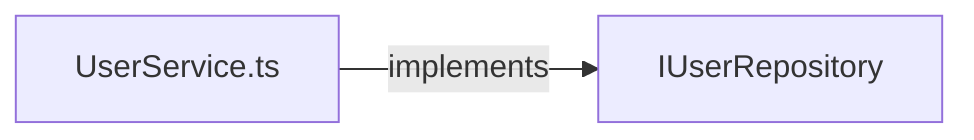
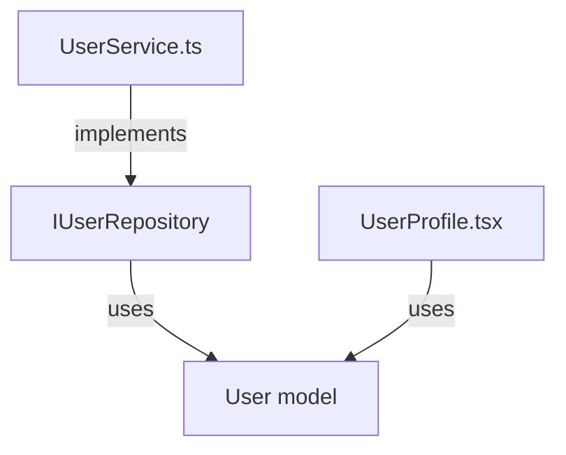
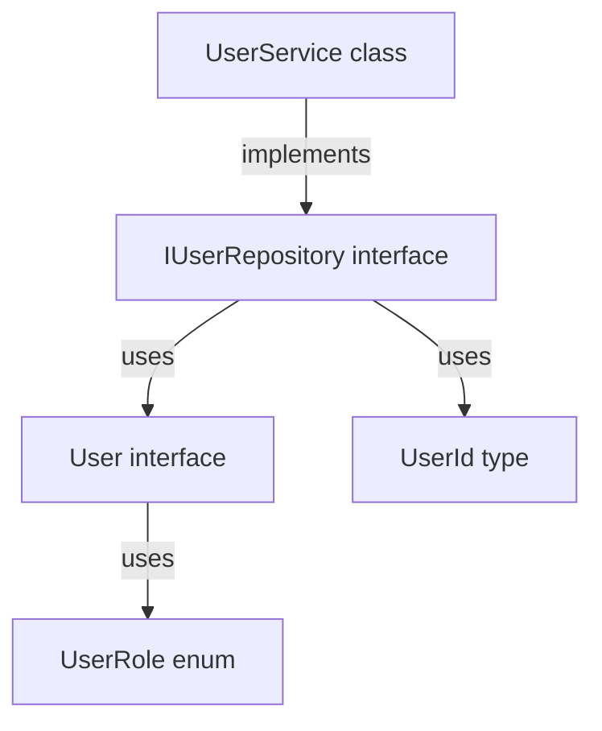

# 抽象层支持示例

## 1. 源代码示例

```typescript
// ========== 文件: src/models/User.ts ==========
export interface User {
  id: string
  name: string
  email: string
  role: UserRole
}

export enum UserRole {
  ADMIN = 'admin',
  USER = 'user',
  GUEST = 'guest'
}

export type UserId = string

// ========== 文件: src/repositories/IUserRepository.ts ==========
import { User, UserId } from '../models/User'

export interface IUserRepository {
  getUser(id: UserId): Promise<User>
  saveUser(user: User): Promise<void>
  deleteUser(id: UserId): Promise<void>
}

// ========== 文件: src/repositories/UserService.ts ==========
import { IUserRepository } from './IUserRepository'
import { User, UserId } from '../models/User'

export class UserService implements IUserRepository {
  async getUser(id: UserId): Promise<User> {
    // 实现...
  }

  async saveUser(user: User): Promise<void> {
    // 实现...
  }

  async deleteUser(id: UserId): Promise<void> {
    // 实现...
  }
}

// ========== 文件: src/components/UserProfile.tsx ==========
import { User } from '../models/User'

interface UserProfileProps {
  user: User  // ← 使用User类型
}

export function UserProfile({ user }: UserProfileProps) {
  return (
    <div>
      <h1>{user.name}</h1>
      <p>{user.email}</p>
      <span>{user.role}</span>
    </div>
  )
}
```

---

## 2. 生成的依赖图(包含抽象层)

### 2.1 节点列表

```json
{
  "nodes": [
    // ===== 抽象节点(Abstract Layer) =====
    {
      "id": "abstract:User",
      "type": "abstract",
      "path": "src/models/User.ts",
      "parent": "component:models",
      "status": "normal",
      "abstractMeta": {
        "kind": "interface",
        "name": "User",
        "sourceFile": "src/models/User.ts",
        "isExported": true
      }
    },
    {
      "id": "abstract:UserRole",
      "type": "abstract",
      "path": "src/models/User.ts",
      "parent": "component:models",
      "status": "normal",
      "abstractMeta": {
        "kind": "enum",
        "name": "UserRole",
        "sourceFile": "src/models/User.ts",
        "isExported": true
      }
    },
    {
      "id": "abstract:UserId",
      "type": "abstract",
      "path": "src/models/User.ts",
      "parent": "component:models",
      "status": "normal",
      "abstractMeta": {
        "kind": "type",
        "name": "UserId",
        "sourceFile": "src/models/User.ts",
        "isExported": true
      }
    },
    {
      "id": "abstract:IUserRepository",
      "type": "abstract",
      "path": "src/repositories/IUserRepository.ts",
      "parent": "component:repositories",
      "status": "normal",
      "abstractMeta": {
        "kind": "interface",
        "name": "IUserRepository",
        "sourceFile": "src/repositories/IUserRepository.ts",
        "isExported": true
      }
    },

    // ===== 文件节点(File Layer) =====
    {
      "id": "file:User.ts",
      "type": "file",
      "path": "src/models/User.ts",
      "parent": "component:models",
      "status": "normal"
    },
    {
      "id": "file:IUserRepository.ts",
      "type": "file",
      "path": "src/repositories/IUserRepository.ts",
      "parent": "component:repositories",
      "status": "normal"
    },
    {
      "id": "file:UserService.ts",
      "type": "file",
      "path": "src/repositories/UserService.ts",
      "parent": "component:repositories",
      "status": "normal"
    },
    {
      "id": "file:UserProfile.tsx",
      "type": "file",
      "path": "src/components/UserProfile.tsx",
      "parent": "component:components",
      "status": "normal"
    },

    // ===== 组件节点(Component Layer) =====
    {
      "id": "component:models",
      "type": "component",
      "path": "src/models",
      "parent": "module:src",
      "status": "normal"
    },
    {
      "id": "component:repositories",
      "type": "component",
      "path": "src/repositories",
      "parent": "module:src",
      "status": "normal"
    },
    {
      "id": "component:components",
      "type": "component",
      "path": "src/components",
      "parent": "module:src",
      "status": "normal"
    },

    // ===== 模块节点(Module Layer) =====
    {
      "id": "module:src",
      "type": "module",
      "path": "src",
      "parent": undefined,
      "status": "normal"
    }
  ]
}
```

### 2.2 边列表

```json
{
  "edges": [
    // ===== 文件依赖(import边) =====
    {
      "from": "file:IUserRepository.ts",
      "to": "file:User.ts",
      "type": "import",
      "status": "normal"
    },
    {
      "from": "file:UserService.ts",
      "to": "file:IUserRepository.ts",
      "type": "import",
      "status": "normal"
    },
    {
      "from": "file:UserService.ts",
      "to": "file:User.ts",
      "type": "import",
      "status": "normal"
    },
    {
      "from": "file:UserProfile.tsx",
      "to": "file:User.ts",
      "type": "import",
      "status": "normal"
    },

    // ===== 实现接口(implement边) =====
    {
      "from": "file:UserService.ts",
      "to": "abstract:IUserRepository",
      "type": "implement",
      "status": "normal",
      "metadata": {
        "symbolName": "IUserRepository",
        "importPath": "./IUserRepository"
      }
    },

    // ===== 使用类型(use边) =====
    {
      "from": "abstract:IUserRepository",
      "to": "abstract:User",
      "type": "use",
      "status": "normal",
      "metadata": {
        "symbolName": "User",
        "importPath": "../models/User"
      }
    },
    {
      "from": "abstract:IUserRepository",
      "to": "abstract:UserId",
      "type": "use",
      "status": "normal",
      "metadata": {
        "symbolName": "UserId",
        "importPath": "../models/User"
      }
    },
    {
      "from": "abstract:User",
      "to": "abstract:UserRole",
      "type": "use",
      "status": "normal",
      "metadata": {
        "symbolName": "UserRole",
        "importPath": null  // 同文件内
      }
    },
    {
      "from": "file:UserProfile.tsx",
      "to": "abstract:User",
      "type": "use",
      "status": "normal",
      "metadata": {
        "symbolName": "User",
        "importPath": "../models/User"
      }
    }
  ]
}
```

---

## 3. 查询场景演示

### 场景1: 查看IUserRepository接口的所有实现

**请求:**
```typescript
getDependencyGraph('/project', {
  mode: 'neighbors',
  level: 'file',
  focusPath: 'src/repositories/IUserRepository.ts',
  edgeTypes: ['implement']
})
```

**返回:**
```json
{
  "nodes": [
    { "id": "abstract:IUserRepository", "type": "abstract", ... },
    { "id": "file:UserService.ts", "type": "file", ... }
  ],
  "edges": [
    {
      "from": "file:UserService.ts",
      "to": "abstract:IUserRepository",
      "type": "implement"
    }
  ]
}
```

**可视化(Mermaid):**


---

### 场景2: 查看User模型的影响范围

**请求:**
```typescript
getDependencyGraph('/project', {
  mode: 'neighbors',
  level: 'abstract',
  focusPath: 'src/models/User.ts',
  edgeTypes: ['use'],
  neighborDepth: 2
})
```

**返回:**
```json
{
  "nodes": [
    { "id": "abstract:User", ... },
    { "id": "abstract:IUserRepository", ... },  // 1层邻居
    { "id": "file:UserProfile.tsx", ... },      // 1层邻居
    { "id": "file:UserService.ts", ... }        // 2层邻居(通过IUserRepository)
  ],
  "edges": [
    { "from": "abstract:IUserRepository", "to": "abstract:User", "type": "use" },
    { "from": "file:UserProfile.tsx", "to": "abstract:User", "type": "use" },
    { "from": "file:UserService.ts", "to": "abstract:IUserRepository", "type": "implement" }
  ]
}
```

**可视化(Mermaid):**


**影响分析:**
- 修改User接口会直接影响:
  1. IUserRepository接口(1层)
  2. UserProfile组件(1层)
- 间接影响:
  3. UserService实现类(2层,通过IUserRepository)

---

### 场景3: 查看某个组件依赖的所有抽象

**请求:**
```typescript
getDependencyGraph('/project', {
  mode: 'focused',
  level: 'abstract',
  focusPath: 'src/components/UserProfile.tsx',
  edgeTypes: ['use']
})
```

**返回:**
```json
{
  "nodes": [
    { "id": "abstract:User", ... }
  ],
  "edges": [
    { "from": "file:UserProfile.tsx", "to": "abstract:User", "type": "use" }
  ]
}
```

**解释:**
UserProfile组件只依赖一个抽象:User接口

---

### 场景4: 查看整个模块的"契约层"

**请求:**
```typescript
getDependencyGraph('/project', {
  mode: 'focused',
  level: 'abstract',
  focusPath: 'src',
  edgeTypes: ['use', 'implement']
})
```

**返回:**
```json
{
  "nodes": [
    { "id": "abstract:User", ... },
    { "id": "abstract:UserRole", ... },
    { "id": "abstract:UserId", ... },
    { "id": "abstract:IUserRepository", ... }
  ],
  "edges": [
    { "from": "abstract:IUserRepository", "to": "abstract:User", "type": "use" },
    { "from": "abstract:IUserRepository", "to": "abstract:UserId", "type": "use" },
    { "from": "abstract:User", "to": "abstract:UserRole", "type": "use" },
    { "from": "file:UserService.ts", "to": "abstract:IUserRepository", "type": "implement" }
  ]
}
```

**可视化(Mermaid):**


**价值:**
- 清晰展示整个模块的"契约层"
- 理解模块的对外接口和内部数据模型
- 评估接口稳定性(被多少个地方使用)

---

## 4. 破坏性变更检测示例

### 变更前: User接口
```typescript
export interface User {
  id: string
  name: string
  email: string
  role: UserRole
}
```

### 变更后: 删除了email字段
```typescript
export interface User {
  id: string
  name: string
  role: UserRole
}
```

### 变更检测结果
```json
{
  "breaking_changes": [
    {
      "type": "interface_field_removed",
      "abstract": "User",
      "field": "email",
      "affected": [
        {
          "file": "src/components/UserProfile.tsx",
          "line": 8,
          "code": "<p>{user.email}</p>"
        }
      ],
      "severity": "high",
      "message": "User.email字段被删除,但UserProfile组件仍在使用"
    }
  ]
}
```

**AI可以据此给出建议:**
> ⚠️ 警告:删除User.email字段是破坏性变更!
>
> 影响范围:
> - UserProfile.tsx(第8行)仍在使用user.email
>
> 建议:
> 1. 先修改UserProfile组件,移除email显示
> 2. 或者保留email字段,标记为@deprecated
> 3. 或者使用可选字段:email?: string

---

## 5. Linus式评价

**品味评级:** 🟢 **Good Taste**

**为什么这个设计是好的?**

1. **数据结构是对的:**
   - 抽象节点和文件节点分离,各司其职
   - implement边和use边语义清晰
   - 不需要复杂的推断,直接从AST提取

2. **解决了实际问题:**
   - "修改接口会影响谁?"→ 用use边反向查询
   - "哪些类实现了这个接口?"→ 用implement边查询
   - "这个组件依赖哪些类型?"→ 用focused模式+use边过滤

3. **可测试:**
   - 每个边都有明确的提取规则
   - 输入(AST节点)和输出(边)是确定性的
   - 不依赖复杂的类型推断

**潜在风险:**
- 泛型约束(如`T extends User`)需要Phase 2支持
- 类型推断(如`const user = getUser()`)需要Phase 3支持
- MVP只做显式类型标注,这是对的

> "先让它work,再让它fast,最后让它beautiful。MVP做显式类型标注足够了,不要一开始就做类型推断,那是个坑。"
